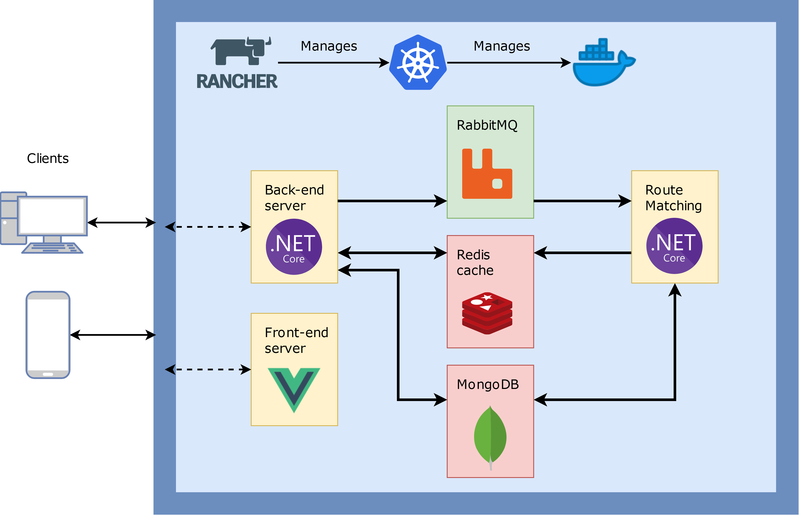

# CorPool: Corporate Carpooling
This readme will describe the details of the CorPool system: the architecture and all components, the implementation details, the infrastructure and its details, and, of course, how to run it yourself.

## Architecture

The CorPool system has 6 main components: a custom developed backend, frontend, and worker service; as well as RabbitMQ as message queue, Redis as cache, and MongoDB as primary storage.

### Front-end
The front-end is an SPA built in Vue.js, nothing too special. It communicates to the backend mostly via a REST api, but for some parts also using Microsofts SignalR, which is an RMI library that makes use of WebSockets, or Server-Sent Events or Long Polling as fallback mechanisms. In this application, only the WebSockets are used to facilitate fully stateless load balancers and backend implementations.

### Back-end
The back-end is an ASP.NET Core application written in C#. The back-end interconnects all components in the system, but mostly only performs simple CRUD operations. It is designed to be fully stateless, so it can fail easily and quickly when something goes wrong.

### Worker
The workers are a component that perform more advanced tasks, in this case it will perform the route finding procedure. In the current form, this algorithm is quite simple, but this could become quite an extensive and complicated procedure that demands more computing power than acceptable within the timeframe of a simple API request. The workers retrieve ride requests from RabbitMQ, find an appropriate ride offer from MongoDB, and send the result back to the user via Redis.

## Technologies and techniques
### SignalR
As mentioned before, SignalR is a RMI library by Microsoft that makes use of WebSockets internally. This simplifies the use and deployment of WebSockets in an application, and it integrates very nicely with the rest of the .NET Core framework via DI and other services.

SignalR is designed to serve not only one-on-one connections between server and client, but it also provides the option to communicate between connections. On a redundant system, this communication goes via a so-called backplane that allows each component to be aware of all available connections. This enables us to send an offer found in the Worker to the front-end via the back-end without any additional coding in the back-end.

### ASP.NET Core Identity
The use of the Identity system in .NET Core allows us to easily provide authentication and authorization functionality in CorPool. We use MongoDB as the backing store, and it will natively offer the use of JWT for authentication instead of session cookies, allowing for a fully stateless backend. The JWTs (and their corresponding expiration date) are stored in the localstorage on the user device.

### Multitenancy
The multitenancy in CorPool is achieved within the framework itself by implementing a custom middleware for .NET Core. The implementation of this can be found in the folder `AspNetCoreTenant`. This system allows all CRUD operations to be tenant-aware without much explicit coding, limiting the chance that a programmer error leaks data between tenants.

The middleware detects the current tenant based on the subdomain of the url, in the form of `<tenant>.<domainname>/<query>`, and injects it into the current `HttpContext`. This allows other components to easily obtain the current tenant, for example the `DatabaseContext` offers a `Tenanted` function that will automatically filter all MongoDB queris to the current tenant.

The main place where tenant-aware code is required is upon insertion and update of new data in the database. This could be improved when using an SQL database, which would allow for more automation in the ORM layer using Entity Framework.

### Healthchecks
The back-end and workers feature intelligent health checks that do not just check whether the main process has not crashed, but that also checks whether the connections with RabbitMQ, Redis, and MongoDB are still alive and functioning properly. When this fails, the service is marked unhealthy and will automatically be restarted or recreated by Kubernetes.

## Deployment and infrastructure
### Rancher
The entirety of the application runs inside a Kubernetes cluster. This cluster is managed by Rancher via RKE and Rancher Server, and is running on top of RancherOS in the CIT Merlin Cloud running OpenStack. This will be elaborated upon in more detail now.

We start with an instance of Rancher Server, a Kubernetes cluster management interface that will give us information on the health of applications deployed, and allows us to manually redeploy applications and change their scale. Rancher Server has the possibility to automatically deploy a Kubernetes cluster on a number of cloud systems, one of which is OpenStack.

Rancher Server utilizes Docker Machine to deploy and provision a number of instances (VMs) in OpenStack using RancherOS as operating system. RancherOS is a minimal Linux distribution that is focused on the use of Docker, excellent for our purposes.

On top of the newly deployed nodes with RancherOS, Rancher Server will ask RKE (Rancher Kubernetes Engine) to deploy a Kubernetes cluster. This cluster will automatically be integrated with OpenStack in terms of obtaining IPs from the floating IP pool and using Cinder Volumes as storage.

So far, unfortunately, the deployment is a semi-manual process. The Rancher Server needs to be installed by hand, after which the cluster deployment is a matter of a single button in the web UI. In theory, this process can be automated, but we chose not to:
- It is non-trivial to automatically deploy Rancher Server
- Deployment is done via Gitlab Runners, but those are run inside the cluster we want to create, yielding a chicken-and-egg problem.
- GitLab is linked to the Kubernetes cluster to improve integration between them when automatically deploying the rest of the application. When (re)creating the cluster on demand, this integration is tricky to establish, further complicating the deployment of the application itself.
- Automatically deploying the clusters might become conflicting with the possibility of managing and scaling the cluster by hand in the web UI. We chose for the latter over the first.
- In general, it is not common for infrastructure (VMs, clusters) to be deployed at the same time as a single application. Typically, infrastructure is defined/deployed independently from the many applications running on it, and it seemed conflicting and odd to put both in the same system. Typically, you do not want to redeploy your Kubernetes cluster when you changed part of your application, and you do not want to rebuild and redeploy your application when you simply want to change part of your infrastructure.

### Kubernetes Cluster
After setting up the cluster in its most basic state, all other deployment steps are automated. We use `helmfile` for provisioning the entirety of the Kubernetes cluster with the application and supporting infrastructure. In short: Kubernetes resources can be defined via the `kubectl` CLI, with the resources defined in yaml files. Helm is a way to combine and package multiple resources into packages, such as one for the backend and one for the frontend. Then Helmfile allows us to define which Helm charts should be deployed and with which configuration.

Helmfile first deploys a number of supporting infrastructure services: `cert-manager` for automated certificate management using Let'sEncrypt (using CRDs), `cloudflare` for automatically adding the DNS definitions of applications in Cloudflare, and `cinder` for using Cinder Volumes in OpenStack as our persistent volumes in Kubernetes. It then deploys the application itself: a ReplicaSet of MongoDB, RabbitMQ, and Redis with automatic failover and persistence in OpenStack, and a scaled Deployment of the front-end, back-end, and worker.

The load balancing of the application is done automatically via the Kubernetes `Ingress` resources. They forward requests coming to any of the nodes in the cluster to any of the app instances (pods) running in the cluster in a round-robin fashion, completely stateless without 'sticky sessions'. Failover between the nodes in Kubernetes is done by registering every node in a separate record in DNS. This is not the most elegent approach, but the Merlin OpenStack cloud does not provide the native OpenStack LoadBalancer implementation that would do this more nicely.

The configuration of our application also contains some secret information such as the CloudFlare API key and the chosen database passwords, that we would not want to be publicly available. Therefore, in Kubernetes, these are stored in Secret resources that provide a secure way of providing these to the services. In the repository, this data is encrypted using `sops`, a tool by Mozilla that encrypts YAML files with several backing stores such as Azure Key Vault (and Google/Amazon alternatives), HashiCorp Vault, or simply a GPG key. We chose for this last approach. So only with our GPG keys we can read the values of these secrets in plain text. `sops` integrates nicely with Helm and Helmfile, and requires on further manual configuration.

### Gitlab Runners
All these different tools and services are combined in Gitlab using their CI/CD features. GitLab will first build the images for the front-end, back-end, and workers using the Kaniko builder. Kaniko is an alternative to the native Docker Build that is optimized for running inside Kubernetes (which is the case for us). After building all Docker images, they will be stored in the GitLab Container Registry.

The next step is for GitLab to use `helmfile` to deploy our applications and supporting services to Kubernetes. We provide the GPG key for decrypting the secrets as run variables that are securely delivered to the executing context, and use Gitlabs native Kubernetes integration to provide access to the cluster. This means that nowhere in our repository we have to specify which cluster to deploy to, this is managed by GitLab. This makes our application repository independent from the infrastructure on which it is deployed.

## Run it yourself
### Docker Compose
Parallel to the Kubernetes deployment, for development purposes we have a more traditional `docker-compose.yml` approach that deploys all services in Docker. This allows anyone to get the application up and running in two simple steps:
- Make a custom `.env` file for your own needs by copying and adapting the `.env.template`.
- Run `docker-compose up -d`

A nice feature in this docker-compose application is the reverse proxy container. This is a simple nginx reverse proxy with the additional feature that it uses the Docker backend and frontend containers as 'failover' for development instances you might run manually. For example, when you want to develop the backend, you might start a debugging instance of the backend (without wanting to rebuild the entire docker contianer) on a different port, or similarly for the front-end (`npm run serve`) to provide automated recompilation and integration with the browser. If a local development instance of either the frontend or backend is running, the reverse proxy will send all requests to there instead of to the Docker container.

### Kubernetes
If you want to run the entire Kubernetes stack yourself, that is somewhat complicated.
Prerequisites:
- Install Docker, `kubectl`, `helm`, `helmfile`, `sops`
- Make sure you have a Kubernetes cluster running on OpenStack (possibly using Rancher, not required) and have the relevant `kubeconfig` file available to you

Steps:
- Build the Docker containers and push them to a repository
- Run `helmfile apply` in the `deployments` directory. Make sure to specify the repository and tag of your Docker images in the `TAG` and `REPOSITORY` environment variables.
- Enjoy!

## Full software stack
Here is a list of all tools, frameworks, and applications used in this project:
- .NET Core
- ASP.NET Core
- .NET Core Identity
- SignalR
- Vue.JS
- Axios
- MongoDB
- RabbitMQ
- Redis
- OpenStack
- Kubernetes (+ CRDs)
- RancherOS
- Rancher Kubernetes Engine
- Rancher Server
- cert-manager
- Cloudflare (`external-dns`)
- Helm
- Helmfile
- Sops
- GitLab
- GitLab Runner
- Kaniko
- npm
- docker-compose
- docker-machine
- WebSockets
